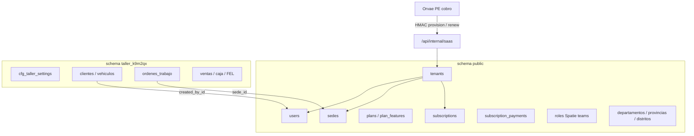

# TallerSaaS — Modelo de base de datos

> Fuente: [`tallersaas-vision-producto.md`](./tallersaas-vision-producto.md) + **multi-tenant real de VetSaaS** (`D:\Programacion\Laravel\LaraReact\vetsaas`).  
> Orvae PE cobra y provisiona. TallerSaaS opera el taller. Mismo esqueleto Orvae.  
> Motor: **PostgreSQL** (multi-schema). PK: **UUID** (`HasUuids`). Moneda: **PEN**. Zona: **America/Lima**.  
> Fecha: ago. 2026.

---

## 1. Norte: clonar VetSaaS, no reinventar

TallerSaaS **no** diseña un multi-tenant nuevo. Copia el de VetSaaS porque **todo nace de Orvae**:

| Capa | Quién | Qué hace |
|------|--------|----------|
| Cobro / checkout / pedidos | **Orvae PE** | Vende el plan, cobra Culqi/Niubiz, emite el alta |
| Producto | **TallerSaaS** | Schema, login, OT, caja, FEL, WhatsApp |
| Planes y features | **TallerSaaS** (`plans` + `plan_features`) | Orvae no decide `max_sedes` ni si hay inventario |
| Pagos SaaS | **Orvae escribe** `subscription_payments` | TallerSaaS **no** procesa la tarjeta del dueño del taller |

```
Orvae PE  --HMAC-->  POST /api/internal/saas/provision
                         │
                         ▼
              TenantProvisioner
                         │
         ┌───────────────┼────────────────┐
         ▼               ▼                ▼
   public.tenants   CREATE SCHEMA    public.users (admin)
   subscriptions    taller_xxxxxx    roles Spatie (team=tenant_id)
   payments Orvae   migrate tenant   must_change_password
                         │
                         ▼
              {slug}.tallersaas.orvae.pe/login
```

Hosts (mismo patrón VetSaaS):

| Host | Quién | `search_path` |
|------|--------|----------------|
| `app.tallersaas.orvae.pe` (central) | superadmin (`users.tenant_id IS NULL`) | `public` |
| `{slug}.tallersaas.orvae.pe` | staff del taller (`tenant_id` = ese tenant) | `"taller_xxxxxx", public` |

Dev: `localhost` central, `{slug}.localhost:8000` tenant.  
`.env`: `TENANT_CENTRAL_DOMAINS`, `TENANT_ROOT_DOMAIN`, `TENANT_SCHEMA_PREFIX=taller_`.

---

## 2. Decisiones copiadas de VetSaaS (no negociar)

| Tema | VetSaaS | TallerSaaS |
|------|---------|------------|
| Aislamiento | `SET search_path TO "<schema>", public` | Igual |
| Nombre físico del schema | `vet_` + 6 chars random (`vet_a1b2c3`) | `taller_` + 6 chars random |
| Slug | Independiente del schema (se puede cambiar el subdominio) | Igual |
| Identidad | `public.users` + `tenant_id` nullable | Igual |
| Single-login | Mismo `User`; `MatchUserTenant` cruza host ↔ `tenant_id` | Igual |
| Email único | Por tenant: `(COALESCE(tenant_id,'__central__'), lower(email))` | Igual |
| Sedes | **`public.sedes`** + `tenant_id` (el panel central las lista / geo / reportes) | Igual |
| Datos operativos | Schema tenant, **sin** `tenant_id` en cada fila | Igual |
| Modelos globales | Trait `UsesPublicSchema` (`public.users`, `public.tenants`…) | Igual |
| PK | `uuid` + `HasUuids` (no bigint, no uuid v7 obligatorio) | Igual |
| Fechas | `timestampsTz()` / `softDeletesTz()` | Igual |
| RBAC | Spatie **teams**, `team_foreign_key = tenant_id` | Igual |
| Provision | `POST /api/internal/saas/provision` HMAC-SHA256 | Igual (mismo contrato Orvae) |
| Cobro SaaS | Orvae; VetSaaS solo lee `subscription_payments` | Igual |
| Estados tenant | `trial`, `active`, `grace`, `suspended`, `cancelled` | Igual (`grace` = impago con cortesía) |
| Onboarding | Columnas en `tenants` (`onboarding_paso`, `onboarding_completado`) | Igual |
| Canal | `canal_adquisicion = orvae` | Igual |
| Migraciones tenant | `database/migrations/tenant/` + `TenantMigration::runInTenant()` | Igual |
| Log migrate | Tabla `migrations` **dentro de cada schema** | Igual |

### 2.1 Qué no hacer (errores del borrador anterior)

- **No** nombrar el schema `taller_{slug}`: si Orvae / soporte cambia el subdominio, el schema físico no se renombra.
- **No** poner `sedes` dentro del schema del tenant: en VetSaaS viven en `public` para plataforma, geo y reportes.
- **No** poner `tenant_id` en `clientes` / `vehiculos` / OT: el aislamiento es el `search_path`.
- **No** cobrar el SaaS dentro de TallerSaaS (Culqi propio). Eso es Orvae.
- **No** email unique global: el mismo correo puede existir en dos talleres distintos.
- **No** filtrar a mano `where('tenant_id')` en tablas del schema tenant. Sí filtrar `sedes.tenant_id` y `users.tenant_id` porque están en `public`.

### 2.2 UUID

```php
use Illuminate\Database\Eloquent\Concerns\HasUuids;

class Cliente extends Model
{
    use HasUuids;
}
```

```php
$table->uuid('id')->primary();
$table->foreignUuid('cliente_id')->constrained('clientes');
$table->foreignUuid('created_by_id')->nullable()->constrained('users')->nullOnDelete();
```

En PostgreSQL las FK a identidad global se declaran a `public.users` / `public.sedes`.

### 2.3 `UsesPublicSchema`

Con `search_path = taller_xxx, public`, Eloquent buscaría `users` primero en el tenant. Los modelos de plataforma **fuerzan** `public.tabla`:

`User`, `Tenant`, `Plan`, `Subscription`, `Sede`, `Distrito`, `Role`, `Permission`, logs de plataforma.

---

## 3. Mapa de schemas



| Dónde | Tablas |
|-------|--------|
| `public` | users, tenants, sedes, plans, plan_features, tenant_plan_overrides, subscriptions, subscription_payments, provision_idempotency_keys, Spatie, ubigeo, platform_settings |
| `taller_{random}` | cfg, clientes, vehículos, citas, servicios, OT, inventario, ventas, caja, FEL, WhatsApp |

---

## 4. Schema `public` — copiar columnas de VetSaaS

Nombres en **español**, mismos tipos. Solo cambia el dominio (taller vs clínica) y el prefijo de schema.

### 4.1 `tenants`

Igual que `vetsaas/database/migrations/2026_05_12_070060_create_tenants_table.php`.

| Columna | Tipo | Notas |
|---------|------|--------|
| id | uuid PK | `HasUuids` |
| slug | varchar(60) unique | Subdominio. Check `^[a-z0-9\-]+$` |
| schema_name | varchar(60) unique | `taller_` + 6 alfanuméricos. **No** se deriva del slug |
| razon_social | varchar(200) | |
| nombre_comercial | varchar(150) nullable | |
| ruc | varchar(11) nullable unique | Check `^\d{11}$` |
| email_admin | varchar(150) unique | Admin inicial |
| telefono | varchar(20) nullable | |
| distrito_id | FK distritos nullable | Ubigeo `public` |
| direccion | varchar(255) nullable | |
| logo_url | varchar(500) nullable | |
| geo_lat / geo_lng | decimal nullable | Reportes plataforma (como VetSaaS) |
| estado | varchar(20) default `trial` | `trial`, `active`, `suspended`, `cancelled` — acceso runtime también `grace` vía suscripción |
| trial_ends_at | timestamptz nullable | |
| suspended_at / suspension_reason | | |
| cancelled_at / cancel_reason | | |
| onboarding_completado | boolean default false | |
| onboarding_paso | smallint default 0 | 0–7 checklist taller |
| timezone | varchar(50) default `America/Lima` | |
| locale | varchar(10) default `es_PE` | |
| canal_adquisicion | varchar(50) nullable | default `orvae` al provisionar |
| referido_por_tenant_id | uuid self-FK nullable | |
| modulos_deshabilitados | json nullable | Override de módulos |
| created_at / updated_at / deleted_at | timestamptz | Soft delete |

Índices parciales VetSaaS: slug/estado `WHERE deleted_at IS NULL`; trial_ends_at `WHERE estado = 'trial'`.

`TenantProvisioner::buildSchemaName()`:

```php
do {
    $name = 'taller_'.strtolower(Str::random(6));
} while (Tenant::where('schema_name', $name)->exists());
```

### 4.2 `users`

Identidad unificada (Fase 2.5-bis VetSaaS).

| Columna | Tipo | Notas |
|---------|------|--------|
| id | uuid PK | |
| tenant_id | uuid FK tenants nullable | **NULL = superadmin / staff Orvae** |
| name | varchar(150) | |
| email | varchar(190) | Unique compuesto, no global |
| password | varchar(255) | |
| must_change_password | boolean default true | Primer login post-Orvae |
| bootstrap_login_token | varchar(64) nullable | Hash SHA-256 del token one-shot |
| bootstrap_login_expires_at | timestamptz nullable | TTL `orvae.tenant.bootstrap_ttl_hours` (48h) |
| phone | varchar(20) nullable | |
| is_active | boolean default true | |
| two_factor_* | Fortify | |
| remember_token | | |
| timestampsTz + softDeletesTz | | |

PostgreSQL:

```sql
CREATE UNIQUE INDEX users_tenant_email_unique
  ON users (COALESCE(tenant_id::text, '__central__'), lower(email));
```

### 4.3 `sedes` (público, no tenant)

Igual que VetSaaS: el superadmin lista sedes de todos los talleres; el tenant filtra `where tenant_id = tenant_id()`.

| Columna | Tipo | Notas |
|---------|------|--------|
| id | uuid PK | |
| tenant_id | uuid FK tenants **NOT NULL** | Unique `(tenant_id, codigo)` |
| nombre | varchar(150) | |
| codigo | varchar(10) | Check `^[A-Z0-9\-]+$` |
| direccion / telefono / email | nullable | |
| distrito_id | FK nullable | |
| distrito / provincia / departamento | varchar cache | |
| serie_factura / serie_boleta | varchar(4) nullable | FEL por sede |
| activa | boolean default true | **No bloquear login si no hay sede** |
| created_by_id / updated_by_id | uuid → users | |
| timestampsTz + softDeletesTz | | |

Onboarding: guiar a crear la primera sede (lección VetSaaS: no redirigir en loop).

### 4.4 `plans` + `plan_features`

Fuente de verdad **en TallerSaaS**. Orvae solo manda `plan_slug` (`starter`, `pro`, `business`, `free`).

**`plans`** (mismas columnas VetSaaS)

| Columna | Tipo |
|---------|------|
| id | uuid |
| codigo | varchar(30) unique — **inmutable** (Orvae lo cita) |
| nombre / descripcion / badge / color_hex | |
| precio_mensual / precio_anual | decimal(10,2) |
| trial_days | smallint |
| orden / es_publico / activo | |
| timestamps | |

**`plan_features`**

| Columna | Tipo |
|---------|------|
| id | uuid |
| plan_id | uuid FK |
| feature | varchar(60) |
| valor_int / valor_bool / valor_str | una de las tres |
| unique(plan_id, feature) | |

Catálogo TallerSaaS (`Plan::FEATURE_CATALOG`):

| feature | type | grupo |
|---------|------|--------|
| max_sedes | int | limites |
| max_usuarios | int | limites |
| max_ot_mes | int | limites |
| inventario | bool | operacion |
| presupuestos | bool | operacion |
| factura_electronica | bool | facturacion |
| whatsapp | bool | comunicaciones |
| reportes | bool | reportes |

**`tenant_plan_overrides`**: igual VetSaaS (`feature`, `extra`, `override`, `motivo`, `expires_at`).

### 4.5 `subscriptions`

TallerSaaS **no** es el merchant. La fila nace en el provisioner cuando Orvae llama.

| Columna | Tipo | Notas |
|---------|------|--------|
| id | uuid | |
| tenant_id | uuid FK | Unique parcial: una no-cancelada |
| plan_id | uuid FK | |
| estado | varchar(20) | `trial`, `active`, `grace`, `suspended`, `cancelled` |
| ciclo | varchar(20) | `mensual`, `trimestral`, `semestral`, `anual` |
| trial_ends_at | timestamptz nullable | |
| current_period_start / end | timestamptz | |
| grace_ends_at | timestamptz nullable | Cortesía post-impago |
| cancelled_at / cancel_reason / cancel_feedback | | |
| precio_pactado | decimal(10,2) | Lo que Orvae cobró |
| descuento_pct | decimal(5,2) default 0 | |
| proximo_cobro_at | timestamptz nullable | |
| timestampsTz | | |

Acceso al subdominio (`TenantSubscriptionAccess`): estados tenant/suscripción en `trial|active|grace`. Fuera de eso → `TenantSuspendedException`.

### 4.6 `subscription_payments`

Lo escribe Orvae (provision / renew). Panel plataforma = read-only + nota / marcar refund ya hecho en Orvae.

| Columna | Tipo |
|---------|------|
| id | uuid |
| subscription_id / tenant_id / plan_id | uuid FK |
| monto / igv_monto / descuento_monto / total | decimal(10,2) |
| moneda | char(3) default PEN |
| estado | `pendiente`, `procesado`, `fallido`, `reembolsado` |
| pasarela | varchar(30) — `orvae`, `culqi`, `niubiz` |
| pasarela_transaction_id | varchar(200) nullable |
| pasarela_response | jsonb nullable |
| periodo_inicio / periodo_fin | timestamptz |
| pagado_at | timestamptz nullable |
| created_at | timestamptz |

### 4.7 `provision_idempotency_keys`

Mismo contrato Aula Virtual / VetSaaS.

| Columna | Tipo |
|---------|------|
| id | bigserial |
| key | varchar(120) unique — header `X-Idempotency-Key` |
| source | varchar(30) default `orvae` |
| tenant_id | uuid nullable |
| status_code | smallint |
| response_body | json |
| created_at / expires_at | timestamptz |

### 4.8 Spatie (teams = tenant)

`config/permission.php`: `'teams' => true`, `'team_foreign_key' => 'tenant_id'`.

Roles **plataforma** (`tenant_id` null): `superadmin`.

Roles **por tenant** (se clonan al provisionar, `TenantRolesSeeder::seedForTenant`):

| Rol | Equivalente VetSaaS |
|-----|---------------------|
| admin_taller | admin_clinica |
| recepcionista | recepcionista |
| mecanico | veterinario |

Permisos plataforma: `plataforma-tenants.*`, `plataforma-planes.*`, `plataforma-suscripciones.*`, `plataforma-cobros.*`.

### 4.9 Ubigeo

`departamentos`, `provincias`, `distritos` en `public` (catálogo INEI). Los modelos tenant referencian `public.distritos(id)`.

### 4.10 Catálogo global de vehículos (opcional, `public`)

`vehicle_makes` / `vehicle_models` — compartido entre talleres. Marca libre se guarda desnormalizada en `vehiculos`.

---

## 5. Contrato Orvae (API interna)

Middleware `VerifyOrvaeProvisionSignature`:

```
X-Orvae-Timestamp:  <unix>
X-Orvae-Signature:  sha256=<hmac_hex("{timestamp}.{raw_body}")>
X-Idempotency-Key:  uuid del pedido Orvae
```

Secret: `ORVAE_PROVISION_HMAC_SECRET`. Skew: 300s.

Rutas (copiar `vetsaas/routes/api.php`):

| Método | Path | Uso |
|--------|------|-----|
| POST | `/api/internal/saas/provision` | Alta: schema + admin + trial/sub |
| POST | `/api/internal/saas/renew` | Renovación pagada en Orvae |
| GET | `/api/internal/saas/tenants/{slug}` | Estado para el portal Orvae |
| GET | `/api/internal/saas/lookup` | Buscar por email admin |
| GET | `/api/internal/saas/showcase` | Cards de venta |

Payload provision (mismo shape VetSaaS):

```json
{
  "external_order_id": "ORV-…",
  "plan_slug": "pro",
  "ciclo": "mensual",
  "tenant_slug": "taller-lopez",
  "razon_social": "Taller López SAC",
  "ruc": "20123456789",
  "admin_nombres": "Luis",
  "admin_apellidos": "López",
  "admin_email": "luis@taller.com",
  "admin_password": "temporal-orvae",
  "canal_adquisicion": "orvae",
  "payment": { "monto": 149, "moneda": "PEN", "pasarela": "orvae", "estado": "procesado" }
}
```

Respuesta 201: `tenant.id`, `slug`, `schema_name`, `login_url`, `bootstrap_url` (one-shot 48h).

TallerSaaS **no** llama a Orvae para crear el tenant: Orvae llama a TallerSaaS.

---

## 6. Runtime (copiar `app/Tenancy` de VetSaaS)

```
app/Tenancy/
  TenantManager.php          SET search_path; cache slug/id; runForSlug
  TenantContext.php          readonly { tenant, schema, slug }
  TenantSchemaMigrator.php   CREATE SCHEMA + migrate path tenant
  Resolvers/SubdomainResolver.php
  Exceptions/TenantNotFoundException.php
  Exceptions/TenantSuspendedException.php
  helpers.php                current_tenant(), tenant_id(), resolve_clinic_tenant_id()
```

Middleware:

| Alias | Clase | Rol |
|-------|--------|-----|
| (web global) | `ResolveTenant` | Host → slug → search_path |
| `tenant.required` | `EnsureTenant` | Solo subdominio taller |
| `tenant.none` | `EnsureNoTenant` | Solo central |
| `tenant.match-user` | `MatchUserTenant` | `user.tenant_id` ↔ host |

Helpers: en TallerSaaS se pueden aliasar `resolve_taller_tenant_id()` = mismo código que `resolve_clinic_tenant_id()`.

Jobs/comandos: `$manager->runForSlug('taller-lopez', fn () => …)` y `forget()` al terminar.

Nunca interpolar `schema_name` desde el request. Siempre desde `tenants.schema_name` saneado `[a-z0-9_]{1,63}`.

---

## 7. Schema tenant — dominio taller

Migraciones en `database/migrations/tenant/`, clase `TenantMigration`, prefijo `tNNN_`.  
Tablas **sin** `tenant_id`. FK a `public.users` y `public.sedes`.

Analogía VetSaaS → TallerSaaS:

| VetSaaS | TallerSaaS |
|---------|------------|
| `cfg_clinic_settings` | `cfg_taller_settings` |
| `propietarios` | `clientes` |
| `pacientes` | `vehiculos` |
| `citas` | `citas` |
| `consultas` | `ordenes_trabajo` |
| `consulta_cargos` | `ot_cargos` (precuenta) |
| `productos` / `existencias_sede` | `repuestos` / `existencias_sede` |
| `ventas` / `venta_lineas` / `venta_pagos` | **igual** (reutilizar caja) |
| `caja_sesiones` / `caja_egresos` | **igual** |
| `fel_documents` / `fel_series` | **igual** |
| `notifications_queue` | **igual** (WhatsApp) |

### 7.1 `cfg_taller_settings` (una fila)

Copiar `cfg_clinic_settings`: ruc, razon_social, nombre_comercial, direccion_fiscal, distrito_id, logo_path, email, telefono, moneda `PEN`, `igv_porcentaje` 18, `precio_incluye_igv` true, colores, WhatsApp display, Nubefact/ApiSunat tokens, `ticket_ancho_mm`, `igv_afectacion`.

Índice único `((TRUE))` — una fila por schema.

### 7.2 `clientes`

Como `propietarios`, nombres de taller:

| Columna | Tipo |
|---------|------|
| id | uuid |
| tipo_documento | varchar(20) — DNI/RUC/CE/PAS |
| numero_documento | varchar(20) |
| nombres / apellidos / razon_social | |
| email / telefono / telefono_alt / whatsapp | |
| direccion + ubigeo (id + strings cache) | |
| notas / activo | |
| created_by_id / updated_by_id | → public.users |
| timestampsTz + softDeletesTz | |

Unique documento por tenant: índice unique `(tipo_documento, numero_documento)` donde documento no nulo.

### 7.3 `vehiculos`

| Columna | Tipo | Notas |
|---------|------|--------|
| id | uuid | |
| cliente_id | uuid FK clientes | Dueño |
| placa | varchar(10) unique | Normalizar mayúsculas |
| vin | varchar(17) nullable | |
| marca / modelo | varchar(80) | |
| make_id / model_id | uuid nullable | Catálogo public |
| anio | smallint nullable | |
| color / motor | varchar nullable | |
| combustible | varchar(20) | gasolina, diesel, glp, gnv, hibrido, electrico |
| transmision | varchar(20) | manual, automatica |
| kilometraje | int nullable | |
| notas / activo | | |
| created_by_id / updated_by_id | | |
| timestampsTz + softDeletesTz | | |

`vehiculo_kilometrajes`: historial (ot_id, km, recorded_at, user_id).

### 7.4 `puestos` (bays, P1)

| Columna | Tipo |
|---------|------|
| id | uuid |
| sede_id | uuid → public.sedes |
| nombre | varchar(60) |
| activo | boolean |
| deleted_at | timestamptz nullable |

### 7.5 `citas`

| Columna | Tipo |
|---------|------|
| id | uuid |
| sede_id | uuid → public.sedes |
| puesto_id | uuid nullable |
| cliente_id / vehiculo_id | uuid |
| assigned_user_id | uuid nullable → users (mecánico) |
| inicia_at / termina_at | timestamptz |
| estado | `programada`, `confirmada`, `en_recepcion`, `convertida`, `no_asistio`, `cancelada` |
| motivo | varchar(255) nullable |
| orden_trabajo_id | uuid nullable |
| reminder_sent_at | timestamptz nullable |
| notas | text nullable |
| created_by_id | uuid |
| timestampsTz + softDeletesTz | |

### 7.6 Catálogo de servicios

`categorias_servicios`, `servicios` (`tipo`: `labor` \| `paquete`), `servicio_paquete_items`.

Precios según `cfg_taller_settings.precio_incluye_igv`.

### 7.7 `ordenes_trabajo` (núcleo)

Estados P0: `abierta`, `en_proceso`, `lista`, `entregada`, `anulada`.  
Subflujo: recepción → diagnóstico → presupuesto → aprobación → trabajos.

| Columna | Tipo |
|---------|------|
| id | uuid |
| sede_id | uuid → public.sedes |
| numero | varchar(30) unique — `OT-2026-00041` |
| cliente_id / vehiculo_id | uuid |
| cita_id / puesto_id / presupuesto_id | uuid nullable |
| estado | varchar(30) |
| ingreso_at / prometida_at / lista_at / entregada_at | timestamptz |
| km_ingreso / km_salida | int nullable |
| solicitud_cliente / diagnostico / notas_internas | text |
| subtotal / descuento_total / igv_total / total | decimal(12,2) |
| pagado_total / saldo | decimal(12,2) |
| lista_notificada_at | timestamptz nullable |
| anulada_at / anulado_motivo | |
| created_by_id / closed_by_id | uuid |
| timestampsTz + softDeletesTz | |

Hijas:

- `orden_trabajo_estado_historial`
- `orden_trabajo_items` (mano de obra / servicios)
- `orden_trabajo_repuestos` (líneas de pieza; P1 liga `movimiento_inventario_id`)
- `orden_trabajo_mecanicos` (`responsable` \| `apoyo`)
- `orden_trabajo_notas`

### 7.8 Precuenta → caja (reutilizar VetSaaS)

Para no reescribir cobro:

1. `ot_cargos` + `ot_cargo_lineas` (equivalente `consulta_cargos`).
2. Al cobrar: `ventas` + `venta_lineas` + `venta_pagos` (parciales).
3. `caja_sesiones` (apertura/cierre) + `caja_egresos`.
4. Unique parcial: una sesión `open` por caja/sede.

Medios: `efectivo`, `yape`, `plin`, `tarjeta`, `transferencia`, `mixto`.

Tras pago: `ordenes_trabajo.pagado_total` / `saldo`. El norte del MVP es OT → venta.

### 7.9 Presupuestos (P1)

`presupuestos` + `presupuesto_items`.  
`public_token` uuid para link/WhatsApp. Estados: `borrador`, `enviado`, `aprobado`, `rechazado`, `vencido`, `convertido`.

### 7.10 Inventario (P1)

Copiar nombres VetSaaS donde se pueda: `categorias_productos` → o `categorias_repuestos`; `productos` como repuestos; `existencias_sede`; `movimientos_inventario`; `proveedores`.  
Stock por `sede_id` (public.sedes). Tipo movimiento: `in`, `out`, `adjust`, `ot_out`, `ot_return`.

### 7.11 FEL (P1)

Reutilizar `fel_series`, `fel_documents` (+ items si aplica). Series por sede (`B001`/`F001`). Factura exige RUC. Tokens en `cfg_taller_settings` (Nubefact / ApiSunat), no globales.

### 7.12 WhatsApp

Cola: `notifications_queue` (mismo de VetSaaS) o `whatsapp_messages` si se simplifica.  
Templates: `cita_recordatorio`, `ot_lista`, `cobro`, `presupuesto`.  
Sesión WA del tenant: `tenant_whatsapp_sessions` en **public** (OpenWA / Meta), como VetSaaS.

### 7.13 Media y secuencias

`media` polimórfica (`vehiculo`, `orden_trabajo`, `cliente`).  
`document_sequences` (`kind`, `sede_id`, `series`, `year`, `last_number`) con `SELECT … FOR UPDATE`.

### 7.14 P2

`comisiones_mecanicos`, `siniestros_seguro`, `cliente_access_tokens` (portal por placa).

---

## 8. Provisioning (paso a paso)

Al `POST provision` (transacción + migrate):

1. Validar slug / plan activo.
2. Insert `tenants` (`estado=trial` o `active` si plan `free`, `canal_adquisicion=orvae`).
3. Insert `subscriptions` + `subscription_payments` si Orvae mandó `payment`.
4. `CREATE SCHEMA taller_xxxxxx` + `artisan migrate --path=database/migrations/tenant`.
5. Seed `cfg_taller_settings` (copia razon_social/ruc/email).
6. `TenantRolesSeeder::seedForTenant($id)`.
7. `User` admin: `must_change_password=true`, rol `admin_taller`.
8. **No** crear sede por defecto (onboarding guiado).
9. Guardar idempotency 201.
10. Devolver `login_url` + `bootstrap_url`.

Comandos espejo:

```
php artisan tallersaas:tenant-migrate taller_k9m2qx
php artisan tallersaas:tenant-migrate-all
php artisan tallersaas:tenant-create-admin {slug}
```

---

## 9. Integridad

| Regla | Dónde |
|-------|--------|
| Placa única | unique en schema tenant |
| Documento cliente único | unique tipo+número |
| Una suscripción viva | unique parcial `tenant_id WHERE estado <> 'cancelled'` |
| Una caja abierta | unique parcial sesión open |
| Superadmin no opera OT en central | `EnsureTenant` + `MatchUserTenant` |
| Impersonation | sesión `tenant_impersonation.tenant_id` |
| Límites de plan | Policies + `plan_features` / overrides |
| Suspender | Orvae/panel → `tenants.estado`; cache `TenantManager::flushCacheFor` |
| Drop schema | Solo cancelado + periodo de gracia; nunca al suspender |

---

## 10. Extensiones PostgreSQL

```sql
CREATE EXTENSION IF NOT EXISTS pg_trgm;
```

GIN trigram: `clientes.nombres`, `vehiculos.placa`, `ordenes_trabajo.numero`.

---

## 11. Fases vs tablas

| Fase | Usar |
|------|------|
| **P0** | public (tenants, users, sedes, plans, subs, payments, Spatie, Orvae API) + cfg, clientes, vehiculos, servicios, OT, citas, ot_cargos, ventas/caja, WhatsApp, onboarding en `tenants` |
| **P1** | presupuestos, inventario, FEL, puestos, reportes |
| **P2** | comisiones, aseguradoras, portal |

Las tablas P1 se pueden crear en migraciones tenant desde el día 1 (como hizo VetSaaS) y ocultar UI por `plan_features`.

---

## 12. Impacto en este repo (hoy)

El starter aún tiene `users.id` bigint, Spatie sin teams y SQLite. Antes de la primera clínica/taller real:

1. `DB_CONNECTION=pgsql`
2. Reescribir `users` a UUID + `tenant_id` (migración estilo VetSaaS `2026_05_15_100000_add_tenant_id_to_users_table`)
3. Spatie uuid + teams `tenant_id`
4. Copiar `app/Tenancy/*`, `TenantProvisioner`, `VerifyOrvaeProvisionSignature`, `config/tenant.php`, `config/orvae.php`
5. `database/migrations/tenant/` con `TenantMigration`
6. `TENANT_SCHEMA_PREFIX=taller_`
7. Hosts `*.tallersaas.orvae.pe`

Código a **clonar**, no reescribir: `TenantManager`, `ResolveTenant`, `MatchUserTenant`, `SaasProvisionController`, `UsesPublicSchema`, caja/FEL/WhatsApp.

Lo único nuevo es el dominio (cliente/vehículo/OT) en el schema tenant.

---

## 13. Modelos

**Plataforma** (`UsesPublicSchema` + `HasUuids`):  
`User`, `Tenant`, `Sede`, `Plan`, `PlanFeature`, `Subscription`, `SubscriptionPayment`, `Distrito`.

**Tenant** (search_path):  
`CfgTallerSetting`, `Cliente`, `Vehiculo`, `Cita`, `Servicio`, `OrdenTrabajo`, `OtCargo`, `Venta`, `CajaSesion`, `FelDocument`, `Repuesto`, `Presupuesto`.

Trait de tenant: el middleware ya hizo `SET search_path`. No hace falta `tenant_id` en el modelo operativo.
